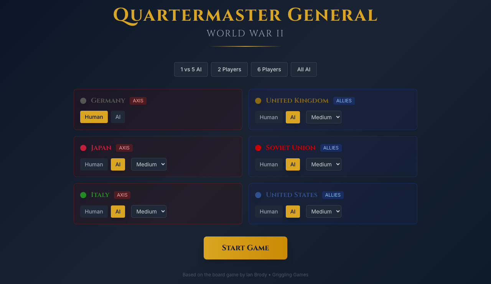
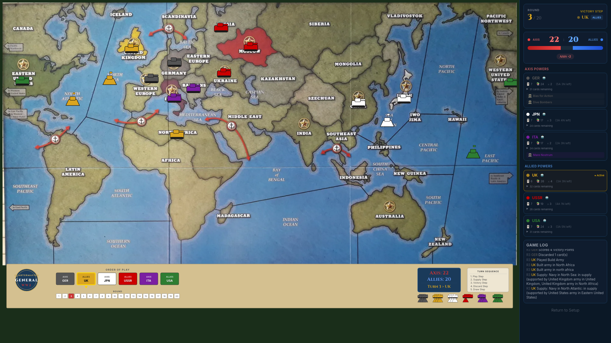

# Quartermaster General WW2 – Web Edition

A browser-based digital implementation of **Quartermaster General WW2: 2nd Edition**, built with React, TypeScript, and Vite.

> Based on the board game by Ian Brody. Learn more on [BoardGameGeek](https://boardgamegeek.com/boardgame/331979/quartermaster-general-ww2-2nd-edition).




---

## Features

- Play as all 6 major powers: Germany, Japan, Italy (Axis) vs USA, UK, USSR (Allies)
- Card-driven gameplay with unique decks per nation
- Supply chain mechanics using BFS pathfinding
- AI opponents with easy / medium / hard difficulty
- Interactive SVG map with pan & zoom
- Fully playable in the browser — no server required

---

## Prerequisites

- [Node.js](https://nodejs.org/) v18 or later
- npm (included with Node.js)

---

## Installation

```bash
# 1. Clone the repository
git clone https://github.com/Linksomaniac/QuarterMasterGeneralWW2.git
cd QuarterMasterGeneralWW2

# 2. Install dependencies
npm install

# 3. Start the development server
npm run dev
```

Then open [http://localhost:5173](http://localhost:5173) in your browser.

---

## Build for Production

```bash
npm run build
```

The compiled output will be in the `dist/` folder and can be served by any static file host.

To preview the production build locally:

```bash
npm run preview
```

---

## Tech Stack

| Tool | Purpose |
|------|---------|
| React 18 | UI components |
| TypeScript | Type safety |
| Vite | Build tool & dev server |
| Zustand + Immer | Game state management |
| Tailwind CSS | Styling |

---

## About the Board Game

**Quartermaster General WW2: 2nd Edition** is a fast-paced, card-driven wargame for 2–6 players set in World War II. Each power has a unique deck of cards to build armies and navies, attack enemies, and maintain supply lines. Supply is everything — cut your enemy's supply and their forces surrender.

[View on BoardGameGeek →](https://boardgamegeek.com/boardgame/331979/quartermaster-general-ww2-2nd-edition)
